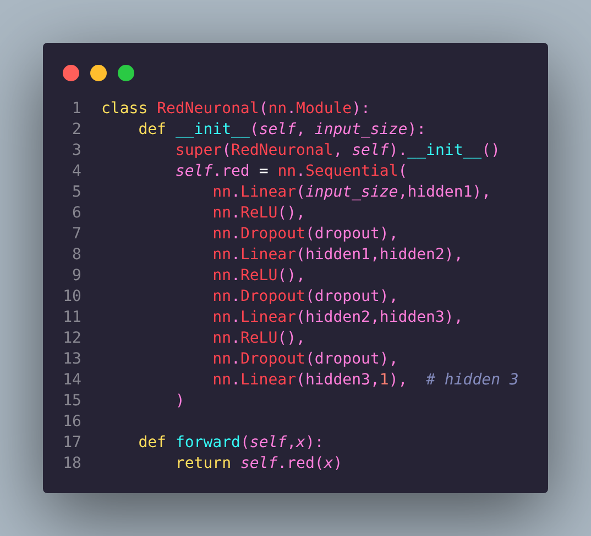
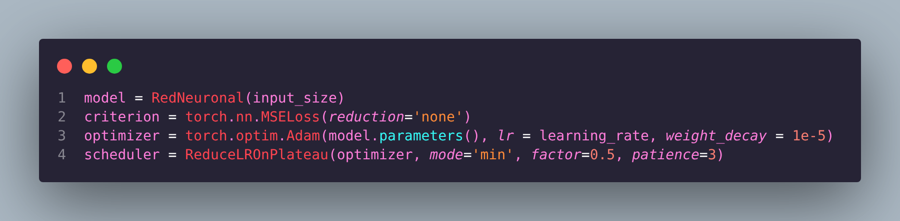
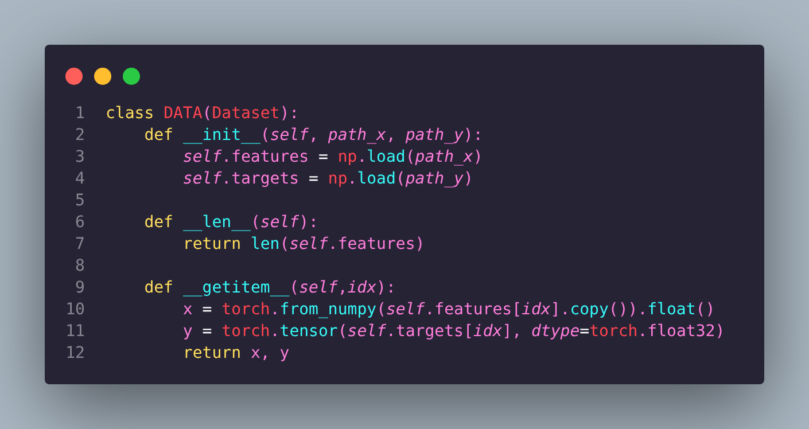
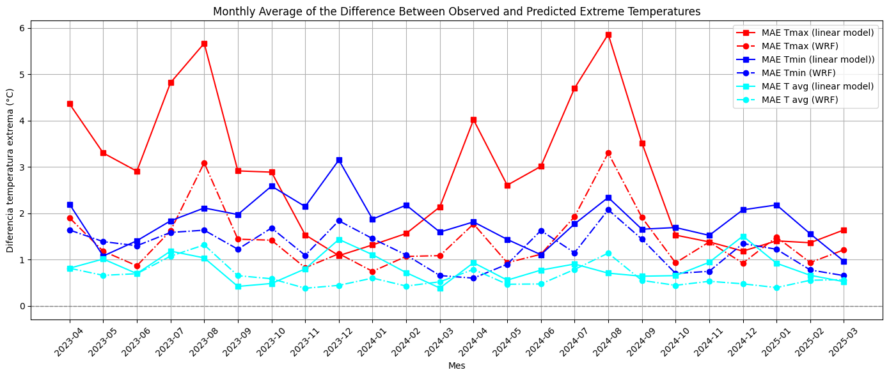
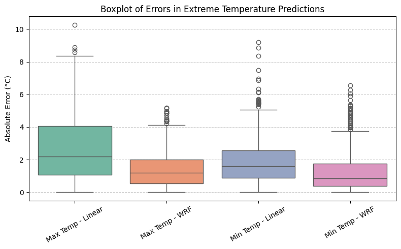
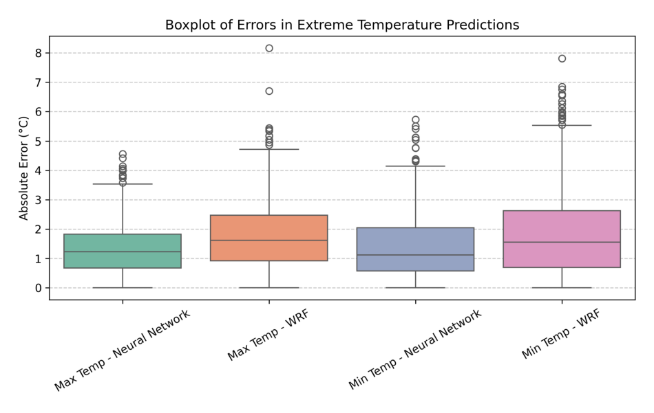

# AITemperaturePrediction


---

This repository contains the work developed during my internship at a meteorology agency, where I focused on applying neural networks to forecast temperature. The goal of the project was to explore how data-driven models can capture temporal and spatial patterns in meteorological data and assess their effectiveness for short-term temperature prediction.

The project is primarily research- and learning-oriented, emphasizing model design, experimentation, and evaluation rather than production-level deployment.

--- 

## Features

-Implementation of neural network models for temperature forecasting



-High-level features for better performance and proper worklow



-Data preprocessing and feature engineering for meteorological datasets



-Training and evaluation pipelines for time-series prediction

-Visualization tools for model performance and forecast results




-Well-documented notebooks and scripts explaining design choices

---

## Installation


1. **Clone the repository:**

```bash
git clone https://github.com/Hugopeb/AITemperaturePrediction.git
cd AITemperaturePrediction
```

2. **Create a virtual environment**

```bash
python -m venv AITemperaturePrediction_VENV
source AITemperaturePrediction/bin/activate
```

3. **Install required packages**

```bash
pip install -r requirements.txt
```
---

## Usage / Examples

After installing dependencies and setting up the virtual
environment you have two different options.

### Using the Jupyter Notebooks

The notebooks in this repository document the full development process of the project. They include explanations of the methodology, commented code, and visualizations that illustrate each step of the workflow. Through a combination of narrative text, graphs, and experiments, the notebooks show how the data is processed, how the neural networks are designed and trained, and how the results are evaluated and interpreted.

Each notebook is intended to be read sequentially and serves both as documentation of the work done during the internship and as a learning resource for understanding the modeling choices and outcomes.

```bash
jupyter notebook NOTEBOOKS/data_preproccessing_github.ipynb
jupyter notebook NOTEBOOKS/Neural_network.ipynb
```

### Using the Python script

If someone wants to **run the code automatically**:

```bash
python model.py
```

This way you can just modify the code without having to go
through the whole notebook and its explanations.

---

## Project Structure

Here’s an overview of the files and folders in this project:

- **data_preproccessing_github.ipynb**: In this notebook I explain how we treated data before feeding it into the net.
- **Neural_network.ipynb**: In here we implement the neural network and its features. We also analyze the results obtained 
- **model.py**: Contains the classes and functions defining your neural network layers and forward/backward passes.
- **images/**: Visual outputs to showcase results, mainly filter activations.
- **requirements.txt**: Install all Python packages needed with `pip install -r requirements.txt`
- **README.md**: This file, explaining the project, how to use it, and providing examples.
- **LICENSE**: File containing the MIT License.

---

## License

This project is licensed under the **MIT License**.

You are free to use, copy, modify, merge, publish, distribute, sublicense, and/or sell copies of this project, under the following conditions:

- The above copyright notice and this permission notice shall be included in all copies or substantial portions of the Software.

**Disclaimer:** The software is provided "as is", without warranty of any kind, express or implied. The authors are not responsible for any claims, damages, or other liabilities.

For the full license text, see the [LICENSE](LICENSE) file.

---

## Conclusion

During this internship project, we successfully developed a neural network capable of predicting temperature with high accuracy. In our experiments, the network was able to outperform classical statistical models, demonstrating the potential of data-driven approaches for meteorological forecasting. This project focused exclusively on temperature prediction, but it highlights how neural networks can capture complex patterns in environmental data.



---

## Note

This project was developed as part of an internship and is intended for educational and research purposes. While the models demonstrate the potential of neural networks for temperature forecasting, they are not optimized for operational meteorological use.

---